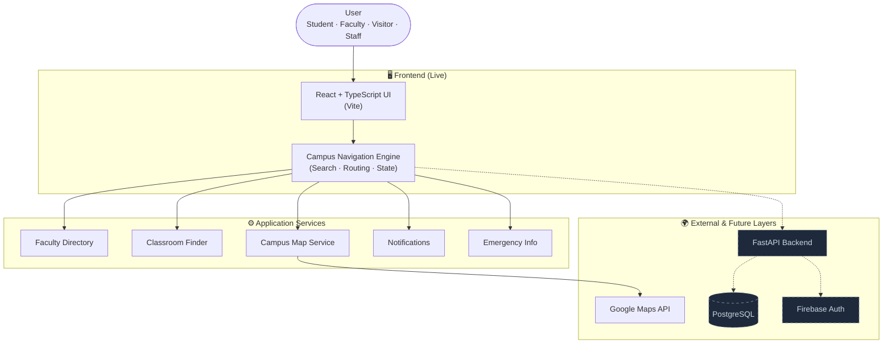

<div align="center">

# 🎓 Campus Connect

### _AI-Powered Smart Campus Navigation & Information System_

[](https://git.io/typing-svg)

<br/>


[-009688?style=for-the-badge&logo=fastapi&logoColor=white>)](#-tech-stack)
[](./LICENSE)
[](#-development-status)
[](#-contributing)

</div>

---

## 📋 Table of Contents

- [About the Project](#-about-the-project)
- [The Problem](#-the-problem)
- [Our Solution](#-our-solution)
- [Key Features](#-key-features)
- [How It Works](#-how-it-works)
- [Project Preview](#-project-preview)
- [System Architecture](#-system-architecture)
- [Tech Stack](#-tech-stack)
- [Project Structure](#-project-structure)
- [Getting Started](#-getting-started)
- [Usage](#-usage)
- [Roadmap](#-roadmap)
- [Target Users](#-target-users)
- [Development Status](#-development-status)
- [Contributing](#-contributing)
- [License](#-license)
- [Team](#-team)
- [Support](#-support)

---

## 📖 About the Project

**Campus Connect** (powered by the _IntelliCampus_ navigation engine) is an AI-powered Smart Campus Navigation and Information System built to simplify campus life for **students, faculty, visitors, and staff**.

Instead of wandering around asking for directions or digging through a static college website, users can instantly **search, locate, and navigate** to classrooms, faculty cabins, laboratories, departments, libraries, and other campus facilities — all from one responsive web app.

> 🎯 The goal: make campus navigation **smarter, faster, and more accessible**, while removing the confusion that new students and visitors face on day one.

---

## ❗ The Problem

Large educational campuses come with a familiar set of navigation headaches:

- 😕 **Students** struggle to locate classrooms, especially in the first weeks of term.
- 🧭 **Visitors and parents** find it hard to navigate an unfamiliar campus.
- 👨‍🏫 **Faculty cabin locations** are scattered and rarely published centrally.
- 🌐 **College websites** are usually static and offer no interactive navigation.
- 🗺 **Google Maps** handles outdoor streets well but offers **limited indoor support** for buildings, floors, and rooms.
- 🏥 **Important facilities** (labs, libraries, emergency rooms, restrooms) are hard to find quickly.

---

## 💡 Our Solution

Campus Connect brings everything together in a **single, centralized smart-navigation platform**:

🔎 Instantly **search** for faculty, classrooms, labs, and facilities
📍 **Navigate** to any destination with an interactive campus map
🗂 Browse a **faculty directory** with cabin numbers and departments
🚑 Access **emergency contacts** in one tap
🔔 Stay updated with campus **notifications & announcements**
🌙 Enjoy a modern, responsive interface with **dark mode**

---

## ✨ Key Features

| #   | Feature                    | Description                                     |
| --- | -------------------------- | ----------------------------------------------- |
| 🏫  | **Campus Navigation**      | Turn-by-turn guidance across the campus         |
| 👨‍🏫  | **Faculty Directory**      | Search faculty by name or department            |
| 👤  | **Faculty Profiles**       | View cabin number, department, and contact info |
| 📍  | **Classroom Finder**       | Locate any classroom instantly                  |
| 🔬  | **Lab & Facility Finder**  | Find laboratories, libraries, and amenities     |
| 🗺  | **Interactive Campus Map** | Digital map with indoor/outdoor support         |
| 🚨  | **Emergency Information**  | Quick access to emergency contacts and services |
| 🔔  | **Notifications**          | Real-time campus announcements                  |
| ⚙️  | **Settings**               | Personalize the experience to your role         |
| 🌙  | **Dark Mode**              | Easy on the eyes, day or night                  |
| 📱  | **Responsive Design**      | Works smoothly on mobile, tablet, and desktop   |

---

## 🔄 How It Works

1. **🔍 Search** — Type a faculty name, classroom code, department, or facility.
2. **📋 Select** — Pick the matching result from the smart, filtered list.
3. **🗺 View on Map** — See the destination pinned on the interactive campus map.
4. **🧭 Navigate** — Follow the suggested route to reach your destination.
5. **🔔 Stay Informed** — Receive notifications and emergency alerts along the way.

---

## 🖼 Project Preview

> 📸 _Screenshots of the live application coming soon._

<div align="center">


**Campus Connect — Making Campus Navigation Smarter, Faster & Simpler**

</div>

<!--
Replace the block above with actual UI screenshots once available, e.g.:
<p align="center">
  
  
</p>
-->

---

## 🏗 System Architecture

The system is designed as a layered, component-based architecture. The **frontend** is live today; the **backend, database, and authentication layers** are planned and shown with dashed lines below.



---

## 🛠 Tech Stack

### 🎨 Frontend _(Current)_

- **[React](https://react.dev/)** — Component-based UI library
- **[TypeScript](https://www.typescriptlang.org/)** — Type-safe JavaScript
- **[Vite](https://vitejs.dev/)** — Lightning-fast build tool & dev server
- **CSS** — Responsive styling with dark-mode support

### 🧠 Backend _(Planned)_

- **[FastAPI](https://fastapi.tiangolo.com/)** (Python) — High-performance REST API

### 🗄️ Database _(Planned)_

- **[PostgreSQL](https://www.postgresql.org/)** — Relational storage for faculty, rooms, and facilities

### 🔐 Authentication _(Planned)_

- **[Firebase Authentication](https://firebase.google.com/products/auth)** — Secure sign-in and role-based access

### 🗺 Maps

- **[Google Maps API](https://developers.google.com/maps)** — Outdoor mapping
- **Custom Indoor Campus Map** — Building- and floor-level navigation

### 🔧 Tools & Version Control

- **Git** & **GitHub** — Source control and collaboration
- **npm** — Package management

---

## 📂 Project Structure

```text
Campus_Connect/
│
├── public/                  # Static assets (images, favicon, etc.)
│   └── images/
│
├── src/
│   ├── components/          # Reusable UI components
│   ├── pages/               # Page-level components
│   ├── assets/              # Fonts, icons, and bundled assets
│   ├── data/                # Static/mock data (faculty, rooms, etc.)
│   └── styles/              # Global and component CSS
│
├── .env.example             # Example environment variables
├── index.html               # Vite entry HTML
├── package.json             # Dependencies and scripts
├── tsconfig.json            # TypeScript configuration
├── vite.config.ts           # Vite configuration
└── README.md                # You are here 📍
```

---

## 🚀 Getting Started

Follow these steps to get a local copy up and running.

### ✅ Prerequisites

Make sure you have the following installed:

- **[Node.js](https://nodejs.org/)** (v18 or higher recommended)
- **[npm](https://www.npmjs.com/)** (comes with Node.js)
- A **Google Maps API key** (for the map feature) — [get one here](https://developers.google.com/maps/documentation/javascript/get-api-key)

### 📥 Installation

1. **Clone the repository**

   ```bash
   git clone https://github.com/YRMESHRAM/Campus_Connect.git
   ```

2. **Navigate into the project directory**

   ```bash
   cd Campus_Connect
   ```

3. **Install dependencies**

   ```bash
   npm install
   ```

4. **Start the development server**

   ```bash
   npm run dev
   ```

5. **Open the app**

   Visit the local URL printed in your terminal (typically `http://localhost:5173`).

### 🏗 Build for Production

```bash
npm run build      # Type-check and bundle the app into dist/
npm run preview    # Preview the production build locally
```

---

## 🎮 Usage

| I want to…                | How to do it                                                          |
| ------------------------- | --------------------------------------------------------------------- |
| 🔎 Find a faculty member  | Use the **search bar** on the home page and type a name or department |
| 📍 Locate a classroom     | Enter the room number (e.g. `C-204`) in the search bar                |
| 🗺 View the campus map    | Open the **Map** section from the navigation menu                     |
| 🚨 See emergency contacts | Visit the **Emergency** section for one-tap contacts                  |
| 🔔 Read announcements     | Check the **Notifications** bell icon                                 |
| 🌙 Toggle dark mode       | Use the theme switch in **Settings** or the header                    |

---

## 📈 Roadmap

The project is under active development. Upcoming enhancements include:

- 🤖 **AI Chatbot** — Conversational campus assistant
- 🧭 **Indoor Navigation** — Floor-level routing inside buildings
- 📱 **Mobile Application** — Native iOS & Android apps
- 🎤 **Voice Search** — Hands-free destination lookup
- 📷 **QR Code Navigation** — Scan a code to get instant directions
- 🛰 **Live Faculty Availability** — Real-time cabin/office status
- 📍 **Real-time Location Tracking** — Live position on the map
- 🥽 **AR Campus Navigation** — Augmented-reality wayfinding

> Have a feature idea? Feel free to [open an issue](https://github.com/YRMESHRAM/Campus_Connect/issues) or submit a pull request!

---

## 🎯 Target Users

- 🎓 **Students** — Find classrooms, labs, and faculty
- 👨‍🏫 **Faculty** — Locate colleagues and meeting rooms
- 👨‍💼 **Staff** — Navigate offices and facilities
- 🧑‍🤝‍🧑 **Visitors & Parents** — Explore the campus without confusion
- 🆕 **New Students** — Get oriented from day one

---

## 🚧 Development Status

This project is currently **frontend-only and in active development**. The React + TypeScript interface is functional, while the following components are on the roadmap:

- ⚙️ FastAPI backend
- 🗄 PostgreSQL database
- 🔐 Firebase authentication
- 🤖 AI-powered features (chatbot, recommendations)

See the [Roadmap](#-roadmap) for details.

---

## 🤝 Contributing

Contributions are what make the open-source community amazing! Any contributions you make are **greatly appreciated**.

1. **Fork** the repository
2. Create your **feature branch**
   ```bash
   git checkout -b feature/YourAmazingFeature
   ```
3. **Commit** your changes
   ```bash
   git commit -m "Add some amazing feature"
   ```
4. **Push** to the branch
   ```bash
   git push origin feature/YourAmazingFeature
   ```
5. Open a **Pull Request**

For major changes, please open an issue first to discuss what you'd like to change. Don't forget to update tests and documentation as appropriate.

---

## 📄 License

Distributed under the **MIT License**. See the [`LICENSE`](./LICENSE) file for details.

```
MIT License

Copyright (c) 2026 Campus Connect Team

Permission is hereby granted, free of charge, to any person obtaining a copy
of this software and associated documentation files (the "Software"), to deal
in the Software without restriction...
```

---

## 👥 Team

This project is a **Group Major Project** developed by B.Tech students of **Artificial Intelligence & Machine Learning** at **S.B. Jain Institute of Technology, Management & Research**.

<div align="center">

| <br/><b>Yash Meshram</b><br/>[@YRMESHRAM](https://github.com/YRMESHRAM) | <br/><b>Arpit Rangari</b><br/>[@ArpitRangari13](https://github.com/ArpitRangari13) | <br/><b>Pratham Pimpalikar</b><br/>[@Prathampimpalikar](https://github.com/Prathampimpalikar) | <br/><b>Tejas Kayarkar</b><br/>[@TejasKayarkar03](https://github.com/TejasKayarkar03) |
| :---------------------------------------------------------------------------------------------------------------------------------------------------------------------------------------: | :--------------------------------------------------------------------------------------------------------------------------------------------------------------------------------------------------------: | :---------------------------------------------------------------------------------------------------------------------------------------------------------------------------------------------------------------------------: | :-------------------------------------------------------------------------------------------------------------------------------------------------------------------------------------------------------------: |

<br/>

[](https://github.com/YRMESHRAM/Campus_Connect)

</div>

---

## ⭐ Support

If you found this project useful, please consider giving it a **⭐ Star on GitHub** — it motivates further development and improvement!

<div align="center">

### 🚀 Campus Connect

### _Making Campus Navigation Smarter, Faster & Simpler_

⭐ Star this repository if you like the project ⭐

</div>
